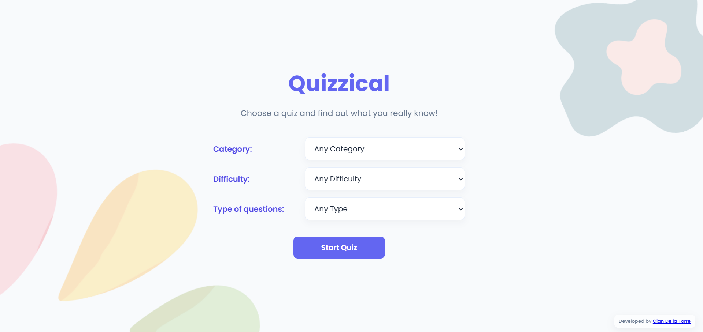
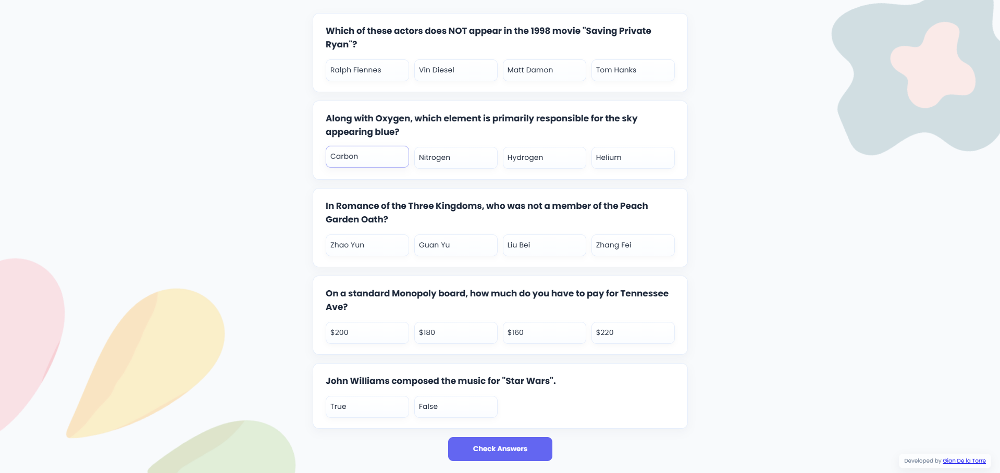
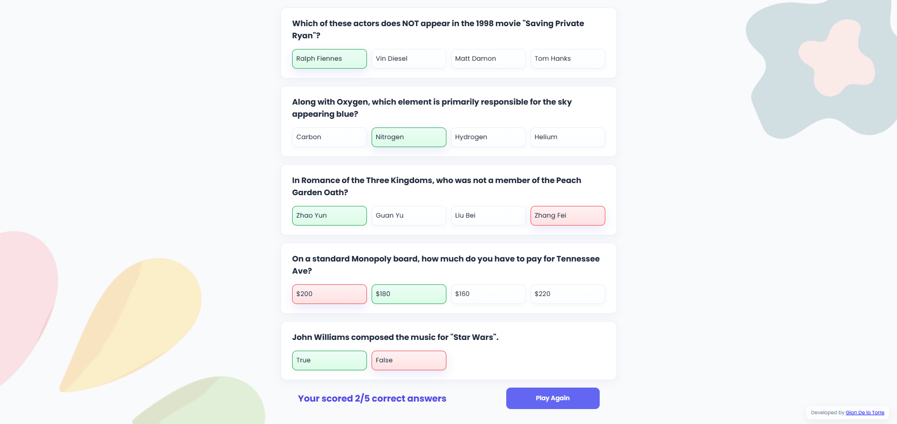

# 🧠 Quizzical

A simple quiz app built with **React**.

It fetches trivia questions from an API, lets you pick your answers, checks your score, and lets you play again. 🎯

---

## 👨‍💻 About This Project
This project is part of my **React learning journey**.

I built this project to practice React concepts like **state, props, and conditional rendering**.

This is the final Solo Project of _**Bob Ziroll's React Course on Scrimba**_ developed from scratch by me.

---

## 🧠 Built With

* **React** - JS Library
* **Vite**
* **CSS 3**
* **HTML 5**

---

## 📸 Preview

---

## 📘 Notes

✅ Completed project for Scrimba

💡 Planning to hook up a backend and extra features in the future

